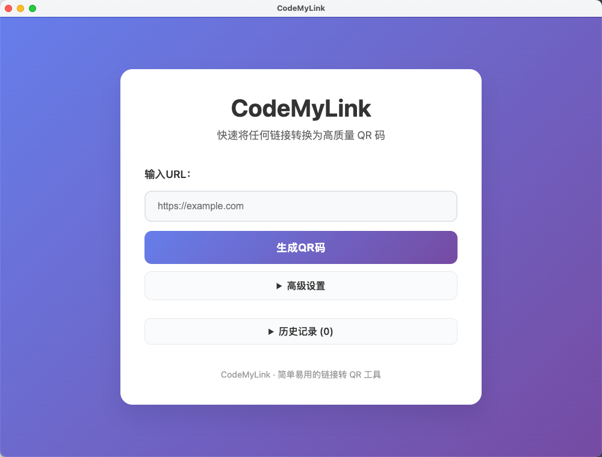

# CodeMyLink

English | [简体中文](README.md)

A lightweight QR conversion tool that turns any URL into a high-quality QR code in seconds.

[GitHub Repository](https://github.com/thenexthop2025/CodeMyLink) · [Latest Release](https://github.com/thenexthop2025/CodeMyLink/releases)



## Download & Install

### macOS
1. Download `CodeMyLink-*.dmg` from the [Releases](https://github.com/thenexthop2025/CodeMyLink/releases) page.
2. Open the DMG and drag `CodeMyLink.app` into `Applications`.
3. If macOS warns that the app is from an unidentified developer, allow it under *System Settings → Privacy & Security*.

### Windows
1. Download `CodeMyLink-*-x64.exe` from [Releases](https://github.com/thenexthop2025/CodeMyLink/releases).
2. Run the installer and follow the setup wizard.
3. If SmartScreen shows “Unknown publisher”, choose *More info → Run anyway*.

## Feature Highlights

- 🔗 Automatically validates the input URL to avoid invalid QR codes
- 🧾 One-click generation of high-resolution QR codes with customizable colors and error correction
- 💾 Export to PNG or SVG for use in posters or documents
- 📋 Built-in copy and history tools for quick reuse of frequent links
- 🖥️ Native Electron desktop experience that works fully offline

## Quick Start (Source)

```bash
git clone https://github.com/thenexthop2025/CodeMyLink.git
cd CodeMyLink
npm install
npm run desktop     # Launch local static server + Electron window
```

## Build from Source

```bash
# Package macOS DMG
npm run build:mac

# Package Windows x64 installer (requires Wine/NSIS)
npm run build:win
```
The build artifacts are output to `dist/`. Icon assets are located at `electron/icon.icns` (macOS) and `electron/icon.ico` (Windows).

## Directory Overview

```
CodeMyLink/
├── electron/          # Electron main process, icons, etc.
├── index.html         # Web entry page
├── script.js          # App logic
├── style.css          # UI styles
├── docs/              # Screenshots and documentation assets
└── package.json       # npm scripts and build config
```

## License

This project is distributed under the [MIT License](LICENSE). Contributions and forks are welcome.

## Contributing

Issues and pull requests are welcome for feature requests and improvements.
